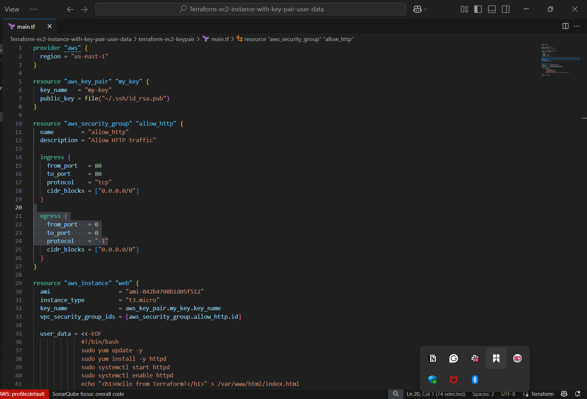
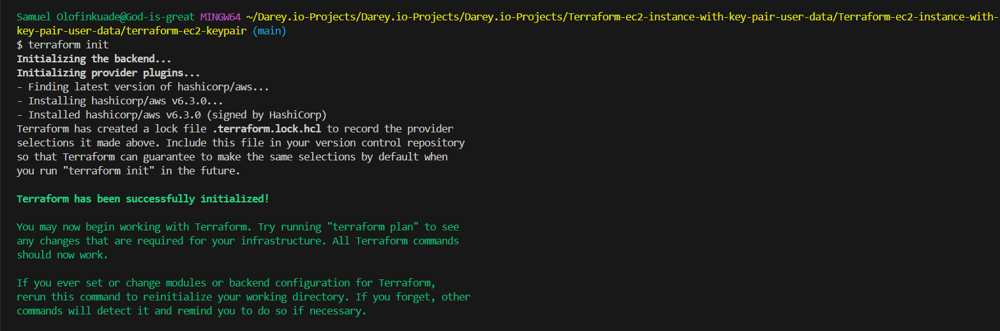
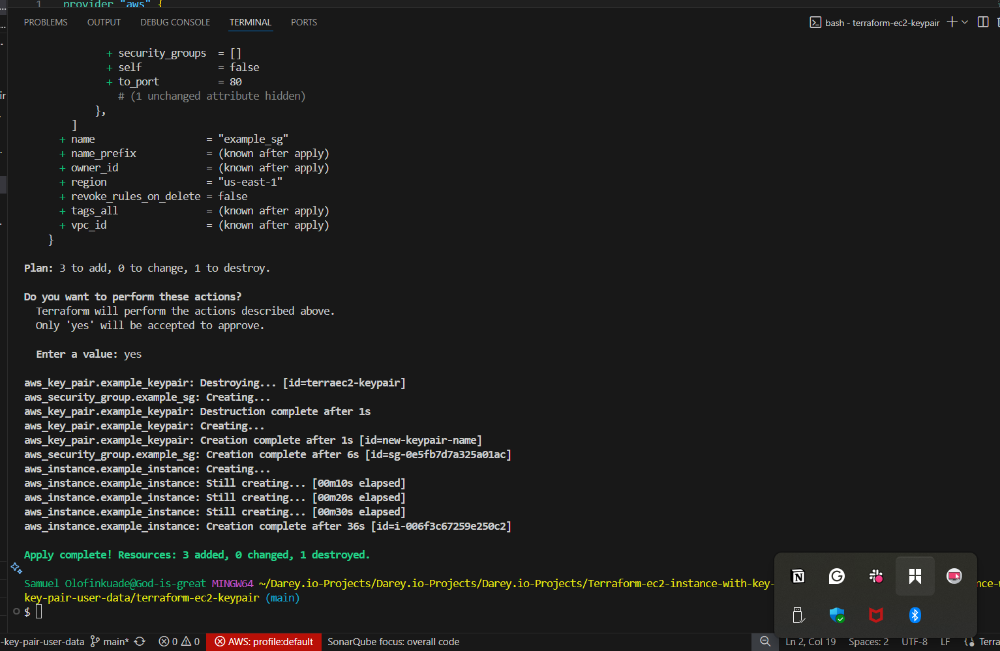
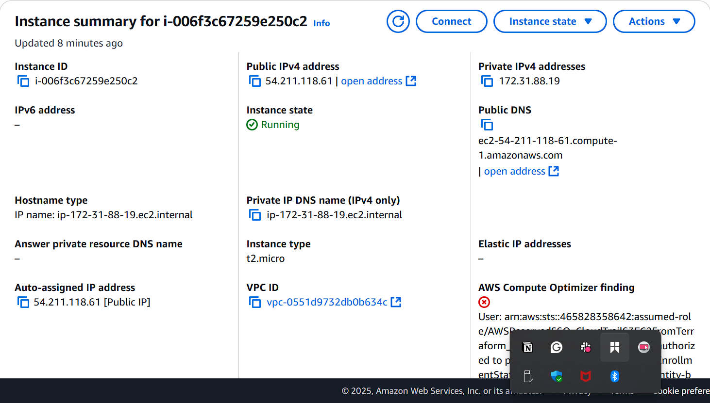
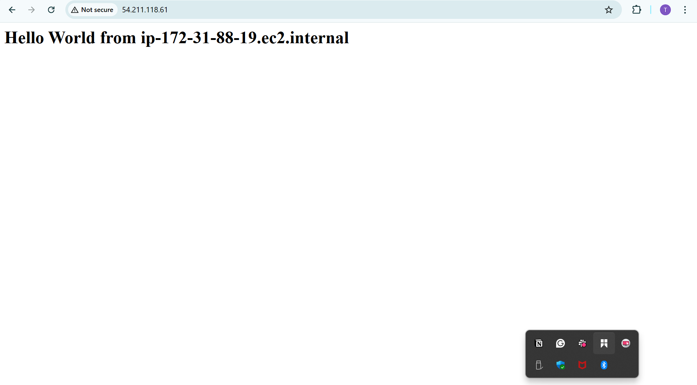
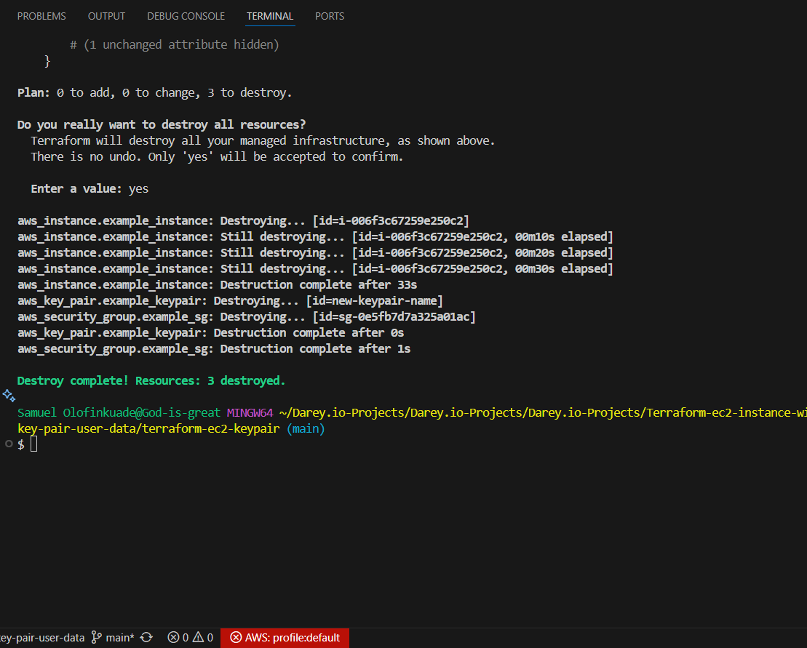

# Terraform-ec2-instance-with-key-pair-user-data

# 🚀 Terraform EC2 + User Data Project

## 📋 Project Objectives

This project uses **Terraform** to automate deployment of an AWS EC2 instance:

* Provision an EC2 instance.
* Create an SSH key pair and configure security group rules.
* Configure the instance with Apache HTTP server via **user data**.
* Make the web server accessible on port 80.

---

## 📝 Prerequisites

* AWS account with permissions to create resources.
* AWS CLI configured with profile `great`.
* Terraform >= 1.x installed.
* SSH public key at `~/.ssh/id_rsa.pub`.
* Internet connection.

---

## 🗂️ Project Structure

```
terraform-ec2-keypair/
├── main.tf          # Terraform configuration
├── README.md        # Documentation
├── images/          # Screenshots and outputs
```

---

## 📄 main.tf Configuration

```hcl
provider "aws" {
  profile = "great"
  region  = "us-east-1"
}

resource "aws_key_pair" "example_keypair" {
  key_name   = "new-keypair-name"
  public_key = file("${pathexpand("~/.ssh/id_rsa.pub")}")
}

resource "aws_security_group" "example_sg" {
  name        = "example_sg"
  description = "Allow HTTP traffic"

  ingress {
    from_port   = 80
    to_port     = 80
    protocol    = "tcp"
    cidr_blocks = ["0.0.0.0/0"]
  }

  egress {
    from_port   = 0
    to_port     = 0
    protocol    = "-1"
    cidr_blocks = ["0.0.0.0/0"]
  }
}

resource "aws_instance" "example_instance" {
  ami                    = "ami-0150ccaf51ab55a51"
  instance_type          = "t2.micro"
  key_name               = aws_key_pair.example_keypair.key_name
  vpc_security_group_ids = [aws_security_group.example_sg.id]

  user_data = <<EOF
#!/bin/bash
yum update -y
yum install -y httpd
systemctl start httpd
systemctl enable httpd
echo "<h1>Hello World from $(hostname -f)</h1>" > /var/www/html/index.html
EOF

  tags = {
    Name = "TerraformWebServer"
  }
}
```
* 


---

## 📷 Screenshots & Images

* **Terraform Init & Apply:** 



* **AWS Console - EC2 Instance:** 

* **Browser - Apache Welcome Page:** 


---

## 🚧 Challenges Faced

* Selecting a valid AMI ID for `us-east-1`.
* Verifying SSH key availability.
* Ensuring Apache starts correctly on boot.
* Opening port 80 via security group.
* Waiting for the instance to fully initialize.

---

## 🪄 How to Deploy

### Initialize Terraform

```bash
terraform init
```

### Review & Apply Configuration

```bash
terraform apply
```

✅ Confirm with `yes`.

### Test Web Server

Visit:

```
http://<http://54.211.118.61>
```

You should see:

> Hello World from <ip-172-31-88-19.ec2.internal>

---

## 🧹 Cleanup

To destroy all resources:

```bash
terraform destroy
```

✅ Confirm with `yes`.

* 

---

## 🌐 GitHub Repository

View the full project and source code: [GitHub Repo](https://github.com/Techytobii/Terraform-ec2-instance-with-key-pair-user-data.git)
